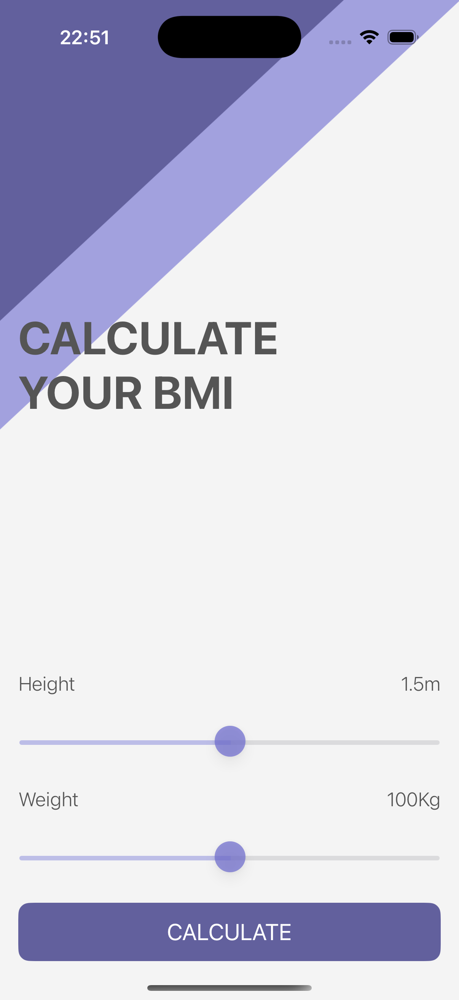
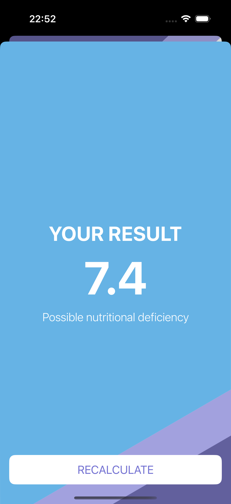
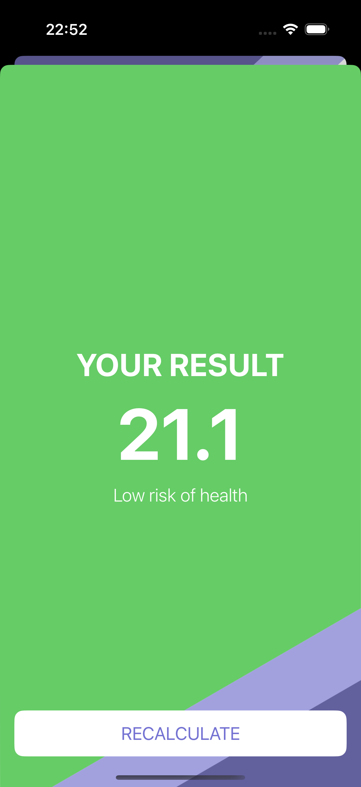

# BMI Calculator App

This is a simple app that calculates **Body Mass Index (BMI)** based on height and weight.  
It provides a quick way to check if your weight is in a healthy range.

---

## 📱 Screenshots

### Home Screen

### Result Screen

  
  
  

## 🚀 Features
- Enter height and weight easily
- Get instant BMI calculation
- Shows categories (Underweight, Normal, Obese)
